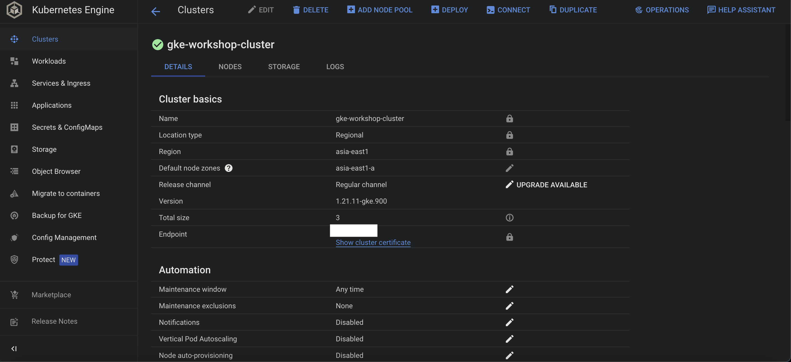

# Born in and Nourished by Azure, living in GKE

## Connected Micro-services with Azure Arc-enabled Kubernetes and SQL Managed Instance

## Introduction

Azure Arc provides a simplified *Governance* and *Management* capability by delivering a consistent multi-cloud and on-premises management platform. Azure Arc-enabled Kubernetes allows us to on-board and manage Kubernetes clusters running anywhere -  clusters running on other public cloud providers (*GCP* or *AWS*) or clusters running on on-premise data-centers (*VMware vSphere* or *Azure Stack HCI*) to Azure Arc. Azure Arc-enabled data services allows us to run Azure data services like *SQL Managed Instance* or *PostgreSQL Hyperscale (preview)* anywhere using Kubernetes.

## What are we going to build?

In this article we will build an end-to-end flow of a connected set of simple micro-services and an SQL Managed Instance all deployed on an **GKE** cluster. The same example can be extended to deploy all the components onto any other cluster of choice - *AKS, EKS* or even on any un-managed cluster.

Following are the components to be deployed:

- **An Azure Function App** - This implemented the core business logic of Add, Update or Fetch from SQL MI database
- **An SQL Managed Instance** - This holds the business data needed for the entire flow and can be accessed only from the above applications running within the cluster

All the above components will be running Privately within the **GKE** cluster and is exposed only through an Ingress Controller. This article would deploy this Ingress Controller as a *Public Load Balancer* for simplicity; but a more stringent and recommended approach would be make this Ingress Controller as an *Internal Load Balancer* with private IP and expose it only through a L7 Load balancer or an API gateway resource, thus making the InBound access more secure.

## Steps to build this

Following are the steps we would follow as we move on:

- Create a basic Regional GKE Cluster. For simplicity, we would not add any additional security or features in this cluster
- **On-board** the cluster onto Azure Arc
- Deploy **Data Controller extension** for Arc
- Deploy **SQL MI** on Azure Arc
  - Connect and review the deployments
- Connect Data services running inside the cluster using the **Azure Data Studio**
- Deploy an **Azure Function App** as Container onto the GKE cluster
- Deploy an **Ingress Controller** to provide access to the application and data services running inside the cluster - we would be using **Nginx** here and configure it as a Public Load Balancer
- Deploy **Ingress routing** within the cluster
- Test the Application flow end-to-end using **Postman**

## Let us delve into this

### Prerequisites

- An active GCP Subscription
- A Github account (optional)
- [kubectl](https://kubernetes.io/docs/tasks/tools/)
- [gcloud sdk](https://cloud.google.com/sdk/docs/install-sdk)
- [Visual Studio Code](https://code.visualstudio.com/download) (*Optional*) or any other preferred IDE

### Prepare Environment

Let us prepare the environment first even before creating the GKE cluster

- Create **Azure Container Registry** on Azure
- Create **Virtual Networks** on GCP
- Create a **Regional GKE** cluster on GCP

#### Setting up GCP

If you are using GCP for the first time you need to run through the following steps.

- Open the GCP sdk folder in Visual Studio Code
- Open VSCode terminal
- Run through the following commands in the terminal to setup the GCP environment

```bash
# cd to GCP sdk folder
cd ./google-cloud-sdk

# Update GCp components
gcloud components update

# Install SDK
./install.sh
```

#### Initialise the Environment

We need to initialise the environment, create a project in GCP and few other configuration options. Multiple options of doing this; easiest of them is to run the following command and then run through the on-screen instructions.

```bash
gcloud init
```

> [!NOTE]
> This command would also allow you to Create or Assign a GCP project and all subsequent resources will be deployed under this project only.
>
> Since we will be using GCP compute resources foe this workload, we need to create a Billing account map our project(s) to it. Please follow this link for details - [Google Cloud Billing](https://cloud.google.com/billing/docs/concepts)

#### Container Registry

We can use [Google Artifact Registry](https://cloud.google.com/artifact-registry) or [Azure Container Registry](https://docs.microsoft.com/en-us/azure/container-registry/) for this exercise. Although we will be using **Azure Container Registry** and pull images from within the GKE cluster with appropriate credentials, let su see what we need to do to use the GAR.

```bash
# Create a service account
gcloud iam service-accounts create <service-account-name> --description="gke workshop sa" --display-name="gke-workshop-sa"

# Assign roles to allow access to the Artifact Registry
gcloud projects add-iam-policy-binding <project-name> \
    --member="serviceAccount:<service-account-name>@<project-name>.iam.gserviceaccount.com" \
    --role="roles/artifactregistry.writer"
```

> [!TIP]
>
> Since we are using *Azure Container Registry* for this exercise, we need to note down the Registry Credentials which will needed later.

#### Create Virtual Networks

Let us create the virtual networks where GKE cluster will be hosted.

```bash
# Create the custom Regional VNET
gcloud compute networks create gke-workshop-vnet --subnet-mode=custom --bgp-routing-mode=regional

# Check list of Networks
gcloud compute networks list

# Add Firewall rules for the VNET
gcloud compute firewall-rules create gke-workshop-fw --network gke-workshop-vnet --allow tcp,udp,icmp

# Create Subnet tohost GKE cluster
gcloud compute networks subnets create gke-cluster-subnet --network=gke-workshop-vnet \
--range=11.0.0.0/24 --region=asia-east1

# Create Subnet to host the GKE cluster
gcloud compute networks subnets list --network=gke-workshop-vnet

# Assign sub ranges for Pods and Services within GKE cluster
gcloud compute networks subnets update gke-cluster-subnet  --region=asia-east1 \
--add-secondary-ranges pod-range=11.0.1.0/24,service-range=11.0.2.0/24
```

### Create GKE cluster




The following command would create a Regional GKE cluster with 3 Nodes, 8 Core/32GB Node Size and with maximum 60 Pods per Node.

```bash
gcloud container clusters create gke-workshop-cluster \
    --region=asia-east1 --enable-ip-alias \
    --network gke-workshop-vnet --subnetwork=gke-cluster-subnet \
    --cluster-secondary-range-name=pod-range --services-secondary-range-name=service-range \
    --node-locations=asia-east1-a --default-max-pods-per-node 60 --machine-type=custom-8-32768
```

#### Connect to the GKE clsuter


```bash
gcloud container clusters get-credentials gke-workshop-cluster --region=asia-east1
```

#### Check the Cluster status

```bash
kubectl get nodes
```


### On-board GKE cluster on Azure Arc


```bash
# Add Azure Arc extension for Azure CLI
az extension add --name connectedk8s

# Register following providers
az provider register --namespace Microsoft.Kubernetes
az provider register --namespace Microsoft.KubernetesConfiguration
az provider register --namespace Microsoft.ExtendedLocation

# on-board GKE cluster onto Azure Arc
az connectedk8s connect -g $arcResourceGroup -n $connectedClusterName
```

> [!TIP]
>
> - This takes sometime to complete
> - The progress status can be checked in the Portal or from the Azure CLI

```bash
# Show the progress
az connectedk8s show -g $arcResourceGroup -n $connectedClusterName
```

> [!TIP]
>
> Wait till status is *Connected* - this is when GKE cluster in fully on-boarded onto Azure Arc

The next task will be to Deploy the Data Controller Extension onto Azure Arc-enabled GKE cluster.

### Deploy Data Controller Extension

Select Add and follow the on-screen instructions. Following set of diagrams would show how the creation process works and finally deploys a Data controller extension onto Azure Arc-enabled GKE cluster. Provide a Name to the **Custom Location**.

>  [!NOTE]
>
> Azure Arc will create a namespace on GKE cluster with this which can be used to track the progress of subsequent deployments.


#### Service Type

- **Load Balancer** - deploy data controller and monitoring services as Load Balancer with Public IP
- **NodePort** - deploy data controller and monitoring services as NodePort IP

> [!NOTE]
>
> - Creating it as a **Load Balancer** would allow us to access the Monitoring services - **Grafana** and **Kibana** publicly - browser or through tools like Azure Data Studio
>
> - Creating it as **NodePort** will make the access restrictive and prevent us from accessing it Publicly.
>
>   We then have to depend on *kubectl* commands or bringing in an **Ingress Controller** in front of these services and allow access.
>
>   In this article, we will follow the 2nd approach and make the entire Inbound flow secured

Select **Create** and look at the CLI to see the progress. Wait for the status to **Ready**. At this stage entire Data Controller setup is complete and we are ready to move further.

```bash
kubectl get datacontrollers -A -w
```

### Deploy SQL Managed Instances

Since now our Data Controller extension is ready on Azure Arc-enabled Kubernetes; we will now go-ahead and deploy SQL Managed Instance onto this.

As we have done for Data Controller extension, we will do the SQL MI deployment through portal and check the status in Azure CLI. Following figures should explain the steps.

#### Service Type

- **Load Balancer** - deploy SQL MI service as Load Balancer with Public IP
- **NodePort** - deploy SQL MI service  as NodePort IP

> [!NOTE]
>
> - Creating it as a Load Balancer would allow us to access the SQL MI service publicly - through browser or through tools like Azure Data Studio
>
> - Creating it as NodePort will make the access restrictive and prevent us from accessing it Publicly.
>
>   We then have to depend on *kubectl* commands or bringing in an Ingress Controller in front of these services and allow access.
>
>   In this article, we will follow the 2nd approach and make the entire Inbound flow secured

Select **Create** and deploy SQL MI containers onto the GKE cluster. Check the status of the progress in the Azure CLI.

```bash
kubectl get pods -n arcgkedccloc -w
```

> [!NOTE]
>
> **arcgkedccloc** is the name of the **Custom Location** chosen earlier. It can be any name of our choice; change the command accordingly - *kubectl get pods -n **<Custom Location Name>** -w*

At this stage, SQL MI is deployed onto GKE cluster through Arc-enabled Data Controller and we are all set to move ahead with this. As we can see that there are multiple services which are exposed with a Public IP and can be accessed from anywhere:

- gkearcsqlmi-external-svc - **SQL MI** service (Port **1433**)
- controller-external-svc - **Data Controller** service
- logsui-external-svc - **Kibana dashboard** service (Port **5601**)
- metricsui-external-svc - **Grafana dashboard** service (Port **3000**)

#### Service Type

##### NodePort

Since the Data Controller is exposed as a NodePort service, so we can not connect to the Database from Data Studio; but we can see the metadata information for the same.

- External endpoint to access the server is private; hence **Connect to Server** from *Data Studio* would fail. We will reach out to the database from within the cluster later
- **Kibana** and **Grafana** endpoints will be accessed from within the cluster through a Load Balancer service
- *We will come back to this again once we complete the deployment of the application stack*

### Connect through Azure CLI

#### Connect to Data Controller Pod

```bash
# aksarcdccloc is the namespace where all data controller resources have been deployed
kubectl get po -n aksarcdccloc
```

- **controldb-0** - Data Controller Pod
- **gkearcsqlmi-0** - SQL MI Pod
- **arcsqlmi-external-svc** - SQL Server service
- **controller-external-svc** - Controller service
- **logsui-external-svc** - Kibana service
- **metricsui-external-svc** - Grafana service

```bash
# Connect to the controldb-0 pod
kubectl exec -it controldb-0 -n aksarcdccloc -c mssql-server -- bash
```

Run following set of commands to setup the Database (**Orders**) and the corresponding Tables (**Products**, **Returns**)

```sql
# Connect to the sql server
# Server or Host name - arcsqlmi-external-svc.<namespace>.svc, <port number>
# UserName - that we had provided while creating the SQL Mi instance throigh portal
# password - that we had provided while creating the SQL Mi instance throigh portal
./opt/mssql-tools/bin/sqlcmd -S arcsqlmi-external-svc.aksarcdccloc.svc,1433 -U <UserName> -P <Password>

CREATE DATABASE Orders
GO

CREATE TABLE dbo.Products (ProductID nvarchar(50) PRIMARY KEY NOT NULL, ProductName varchar(25) NOT NULL, Price money NULL, Quantity float, ProductDescription varchar(max) NULL)
GO

CREATE TABLE dbo.Returns (ProductID nvarchar(50) PRIMARY KEY NOT NULL, ProductName varchar(25) NOT NULL, Quantity float, Reason varchar(max) NULL)
GO
```

### Applications

- Clone the [Repository](https://github.com/monojit18/GCP-Workshop.git)

- Create a **Storage Account** from the Azure Portal for Function app to cache metadata and state

  > [!TIP]
  >
  > Note down the Storage Account credentials, **ConnectionString**, which will needed later.

#### SqlConnectArcApp

- An Azure Function App which is http triggered and accepts an Order for a Product
- If the requested quantity of the **Orders** is *more than an upper bound*, say, 100 it Rejects the Order and send this to the **Returns** Table
- Similarly, if the requested quantity of the Order is *less than an lower bound*, say, 10 it Rejects the Order and send this to the **Returns** Table
- Everything else goes to **Products** Table

##### Deploy Function App

- Go to **Functions/SqlConnectArcApp/SqlConnectArcApp** folder

- Open **local.settings.template.json**

  - Rename the file to **local.settings.json**
  - **SQLConnectionString** - Replace **UserName** and **Password** with appropriate values as set before
  
- Build the Function App and Push to Azure Container Registry

  ```bash
  az acr build -t <acrName>.azurecr.io/sqlconnectarcapp:v1.0.0 -r <acrName> .
  ```

#### Deploy Applications onto GKE cluster

We will now configure the GKE cluster and deploy few additional resources to make the deployment work seamlessly for both Function App and thus for the entire end-to-end flow.

```bash
# Create Secret for accessing and downloading images from ACR
kubectl create secret docker-registry gkewkshpacr-secret --docker-server=<ACR server> --docker-username=<ACR username> --docker-password=<ACR password>

# Create Secret for the Function app to connect to SQL Mi Database
kubectl create secret generic sqlconn-secret --from-literal=SQLConnectionString="<value from local.settings.json>" --from-literal=AzureWebJobsStorage="<Storage account credentials>"

# Go to AzureToGKE folder
cd AzureToGKE

# Deploy Azure Function App - CrossCloudApp
kubectl apply -f ./Deployments/microservices/sqlconnectarcapp.yaml
```

> [!NOTE]
>
> Although we have deployed all applications and services onto the GKE cluster, the major services for Data Controller extension are all **NodePort** and services for the applications are all **Cluster IP**; hence we would need an **Ingress Controller** which will be public facing Load Balancer and with a **Public IP**. This Ingress Controller along with **K8s Ingress** routing will send traffic to appropriate backend services - for *Application services* as well as for *Data Controller extension services*.

#### Deploy Nginx Ingress Controller

```bash
# Install Nginx Ingress Controller
helm repo add ingress-nginx https://kubernetes.github.io/ingress-nginx
helm repo update

kubectl create ns arc-nginx-ingess-ns
helm install nginx-ingess ingress-nginx/ingress-nginx --namespace nginx-ingess-ns \
--set controller.replicaCount=2 --create-namespace

# Post Installation - check the Public IP
kubectl get svc -n nginx-ingess-ns -w
```

> [!TIP]
>
> - Note down the **Public IP** as we will need this later
> - This can be added as an **A-record** in DNS server to make it better accessible

#### Deploy K8s Ingress

```bash
# Go to testgke folder
cd AzureToGKE

# Deploy Ingress object for API
kubectl apply -f ./Deployments/ingress/arc-gke-apis-ingress.yaml

# Deploy Ingress object for Metric services for Datacontroller
kubectl apply -f ./Deployments/ingress/arc-gke-ingress.yaml
```

### Test the Application flow

Let us now test the application flow end-to-end.

#### Add Products

```bash
# Quantity > 10 and < 500 so will go to Products
curl -X POST https://<dns-name>/sql/api/orders --data '{"name": "Civic23", "price": 1300.00, "desc": "Car", "quantity": 200}'
```

#### Add Returns

```bash
# Quantity < 10, too low, so will go to Returns
curl -X POST https://<dns-name>/sql/api/orders --data '{"name": "Ciaz", "price": 800.00, "desc": "Car", "quantity": 8}'
```

#### Get Products

```bash
curl https://<dns-name>/sql/api/orders/products
```

#### Get Returns

```bash
curl https://<dns-name>/sql/api/orders/returns
```

#### Metrics

> [!TIP]
>
> An A-record has to be created with the Public IP of the Nginx Ingress Controller pointing to grafanagkearc.<dns-name>.

```bash
# In a browser type
https://grafanagkearc.<dns-name>
```


#### Logs

> [!TIP]
>
> An A-record has to be created with the Public IP of the Nginx Ingress Controller pointing to kibanagkearc.<dns-name>.

```bash
# In a browser type
https://kibanaarc.<dns-name>/app/kibana#/discover?_a=(query:(language:kuery,query:'custom_resource_name:arcsqlmi'))
```


### Conclusion

This end to end application flow depicts how multiple event driven applications - two n this case, an Azure function app - can talk to each other seamlessly, **run anywhere** and can **maintain state anywhere** - using SQL Managed Instance as Containers and leveraging *Azure Arc-enabled k8s* and *Azure Arc-enabled Data Services*. This represents a cost effective, flexible, resilient way of running Cloud Native Apps on variety platforms - **On-Premise**, **Edge** or **Cloud**.

## References

- [Source Code](https://github.com/monojit18/GCP-Workshop.git) at Github
- [GKE Regional cluster](https://cloud.google.com/kubernetes-engine/docs/how-to/creating-a-regional-cluster#gcloud-init)
- [Azure Arc-enabled data services](https://docs.microsoft.com/en-us/azure/azure-arc/data/overview)
- [Azure Arc-enabled Kubernetes](https://docs.microsoft.com/en-us/azure/azure-arc/kubernetes/overview)
- [SQL managed instance on Azure Arc](https://docs.microsoft.com/en-us/azure/azure-arc/data/create-sql-managed-instance?tabs=indirectly)

