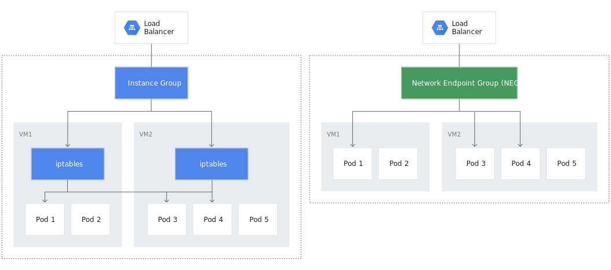
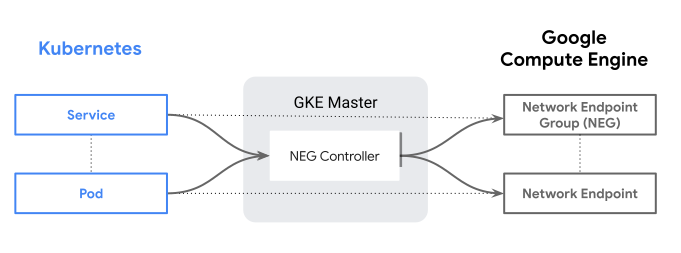
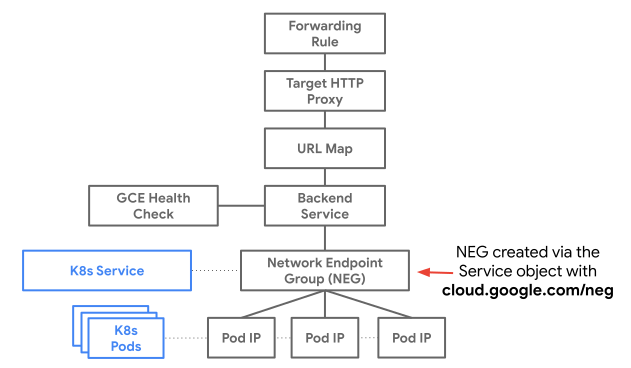
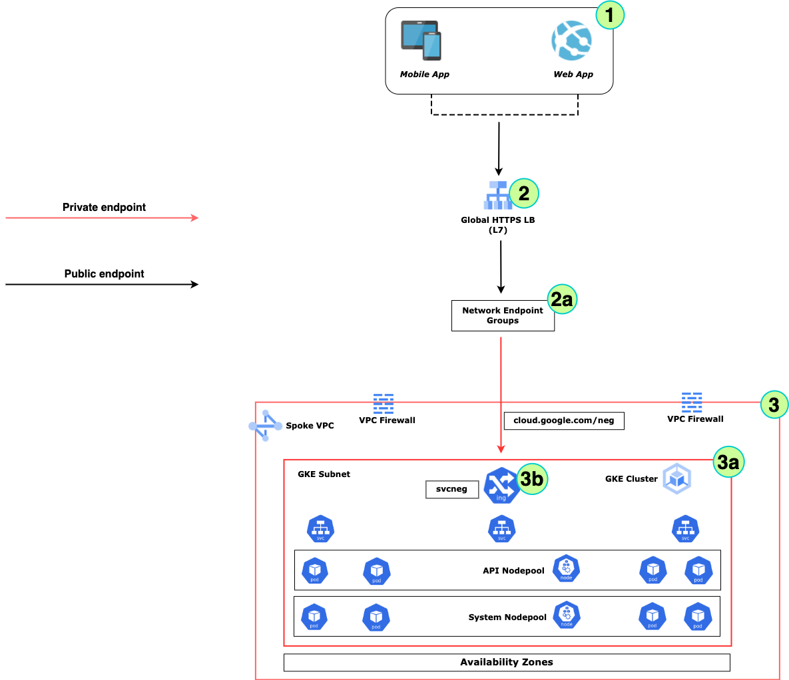

# Securely Ingress to GKE using NEGs

## Introduction

There are multiple ways to securely connect to backend micro services deployed in GKE cluster. The purpose of this document is to depict one such way on how to achieve this using [Container Native Load Balancing](https://cloud.google.com/kubernetes-engine/docs/concepts/container-native-load-balancing)

## What is Container Native Load Balancing?



- The diagram depicts a comparison between traditional LB and Container-Native LB (*right hand side*)
- Traffic distributed to PODs directly
- No need for the extra hop introduced by **kube-proxy** in the case of traditional LB process
- Improved **latency** and **throughput**
- Better **observability** and **troubleshooting** capability; users can have deep visibility into the issues at the POD level
- A cost Effective, Secured and Performant way to connect to GKE cluster

## How does it work with GKE?



- A [NEG](https://cloud.google.com/load-balancing/docs/negs) represents a group of endpoints. In this case it is a group of POD IPs

- **NEG controller** in GKE manages the NEGs

- NEGs can be added as backend services for External HTTP(S) LBs

- K8s Services should be configured to create NEGs

- Backend Service of LB can confiugred as an NEG endpoint

- All calls from outside the GKE cluster will be distributed to the PODs directly

  

## Steps to build this

Following are the steps we would follow as we move on:

- Create required Infrastructure

- Create a basic **Regional GKE Cluster**. We will create this as a **Private** cluster; but all discussions hold good for a **Public** cluster as well

- Deploy couple of simple micro-services onto the GKE cluster

- Deploy **Nginx Ingress Controller** as a **K8s Service** onto the GKE cluster. Configure the service to create an NEG onto GCP

  > __NOTE__
  >
  > - Creating Ingress controller as a **K8s Service** is the key
  >
  > - This document uses Nginx as Ingress controller; but this would work with any other Ingress controller also viz. 
  >
  >   [GKE-Ingress](https://cloud.google.com/kubernetes-engine/docs/concepts/ingress)

- Offload SSL at the Nginx Ingress layer within the cluster

- Create a ***Global or Regional* HTTP(S) Load Balancer (Layer 7)** that would connect to the **NEG enpoints** which in-turn send traffic to the PODs within the GKE cluster

- Test the Application flow end-to-end using **Postman**

## Let us delve into this



### Prerequisites

- An active GCP Subscription
- A Github account (optional)
- [kubectl](https://kubernetes.io/docs/tasks/tools/)
- [gcloud sdk](https://cloud.google.com/sdk/docs/install-sdk)
- [Visual Studio Code](https://code.visualstudio.com/download) (*Optional*) or any other preferred IDE

### Prepare Environment

Let us prepare the environment first even before creating the GKE cluster

- Setup few **Environment** variables

  ```bash
  PROJECT_NAME="cloud-native-spoke"
  REGION="<compute/region>"
  ZONE="<compute/zone>"
  SA_NAME="<sa-name>"
  GSA="$SA_NAME@${PROJECT_NAME}.iam.gserviceaccount.com"
  CLUSTER="gke-private-cluster"
  VPC_NAME="spoke-vpc"
  CLUSTER_SUBNET_NAME="gke-cluster-subnet"
  PROXY_SUBNET_NAME="gke-proxy-only-subnet"
  PSC_SUBNET_NAME="gke-psc-subnet"
  JUMP_SERVER_SUBNET_NAME="jumper-server-subnet"
  ```

- Create and Configure a **GCP project**

  ```bash
  gcloud projects create $PROJECT_NAME
  
  #Set this as the Current project
  gcloud config set project $PROJECT_NAME
  
  #Enable Region and Zone for the compute
  gcloud config set compute/region $REGION
  gcloud config set compute/zone $ZONE
  ```

- Create a **Service Account** with **Owner** privilege that would be used across various resources in this example

  ```bash
  gcloud iam service-accounts create $GSA --display-name "SA for All Infra"
  gcloud iam service-accounts list
  
  gcloud iam service-accounts keys create "$SA_NAME.json" --iam-account=$GSA
  
  gcloud projects add-iam-policy-binding $PROJECT_NAME --role="roles/owner" \
  --member="serviceAccount:${GSA}"
  
  #Authenticate with the Servie Account - $GSA
  gcloud auth activate-service-account $GSA --key-file="$SA_NAME.json"
  ```

- Create **Network** infrastructure

  ```bash
  gcloud compute networks create $VPC_NAME --project=$PROJECT_NAME --subnet-mode=custom --mtu=1460 \
  --bgp-routing-mode=regional
  
  #Subnet for GKE cluster
  gcloud compute networks subnets create $CLUSTER_SUBNET_NAME --network=$VPC_NAME --range=10.0.0.0/22
  
  #Secondary IP ranges for GKE cluster subnet; these ranges are used by PODs and Services in the GKE cluster
  gcloud compute networks subnets update $CLUSTER_SUBNET_NAME \
  --add-secondary-ranges=pods-range=10.1.0.0/16,services-range=10.2.0.0/16
  
  #Proxy Subnet - needed for proxy of Internal HTTP(S) LB
  gcloud compute networks subnets create $PROXY_SUBNET_NAME --purpose=REGIONAL_MANAGED_PROXY --role=ACTIVE --network=$VPC_NAME --range=10.0.4.0/24
  
  #Subnet for Private Service Connect - needed for connecting to Apigee from Global HTTP(s) LB over Private Endpoint
  gcloud compute networks subnets create $PSC_SUBNET_NAME --purpose=PRIVATE_SERVICE_CONNECT --role=ACTIVE \
  --network=$VPC_NAME --range=10.0.5.0/24
  
  #Subnet for Jump Server VM (Optional) - needed for accessing/testing the Private Endpoints
  gcloud compute networks subnets create $JUMP_SERVER_SUBNET_NAME --network=$VPC_NAME --range=10.0.7.0/24
  ```

- Create **Firewall Rules** for the VPC network

  ```bash
  #Allow ssh from all sources
  gcloud compute firewall-rules create allow-ssh-rule --network $VPC_NAME --allow tcp:22 \
  --source-ranges=0.0.0.0/0
  
  #Allow ingress from GFE (Google Front End) IPs for Health check of the backend services of the Load Balancer
  gcloud compute firewall-rules create allow-health-check --network=$VPC_NAME \
  --action=allow --direction=ingress --source-ranges=130.211.0.0/22,35.191.0.0/16 --rules=tcp
  
  #Allow ingress from Proxy Subnet for Internal HTTP(S) LB
  gcloud compute firewall-rules create allow-proxies --network=$VPC_NAME \
  --action=allow --direction=ingress --source-ranges=10.0.4.0/24 --rules=tcp:80,tcp:443,tcp:8080
  
  #Allow ingress from Master node CIDR
  gcloud compute firewall-rules create allow-default-internal --network=$VPC_NAME \
  --action=allow --direction=ingress --source-ranges=10.0.6.0/28 --rules=tcp:80,tcp:443,tcp:8443,tcp:8080
  
  #Allow ingress from Jump Server
  gcloud compute firewall-rules create allow-jumper-internal --network=$VPC_NAME \
  --action=allow --direction=ingress --source-ranges=10.0.7.0/24 --rules=tcp:80,tcp:443,tcp:8443,tcp:8080
  ```

- Create **NAT Gateway**

  ```bash
  #Private GKE cluster would have all outbound connections blocked by default. To enable this we need a NAT gateway to be associated with the GKE cluster subnet
  
  gcloud compute addresses create $REGION-nat-ip --region=$REGION
  gcloud compute routers create rtr-$REGION --network=$VPC_NAME --region=$REGION
  
  gcloud compute routers nats create nat-gw-$REGION --router=rtr-$REGION --region=$REGION \
  --nat-external-ip-pool=$REGION-nat-ip --nat-all-subnet-ip-ranges --enable-logging
  ```
  
- Setup a **Jump Server VM**

  ```bash
  #This will be designated as the only source for accessing the Private GKE cluster
  gcloud compute addresses create gke-jump-server-ip --region=$REGION
  JUMPSERERIP=$(gcloud compute addresses describe gke-jump-server-ip --format="get(address)")
  
  #Create Jump Server VM
  gcloud compute instances create jumper-server --image-family=debian-10 --image-project=debian-cloud \
  --network=$VPC_NAME --subnet=$JUMP_SERVER_SUBNET_NAME --zone=$ZONE --project=$PROJECT_NAME
  
  #Internal IP of Jump Server VM
  gcloud compute instances describe jumper-server --format="get(networkInterfaces[0].networkIP)" \
  --project=$PROJECT_NAME
  
  #External IP of Jump Server VM
  gcloud compute instances describe jumper-server \
  --format="get(networkInterfaces[0].accessConfigs[0].natIP)" --project=$PROJECT_SPOKE
  ```
  
- Configure **Jump Server VM**

  ```bash
  #Connect to the Jump server VM from local machine or cloud shell
  gcloud compute ssh --zone $ZONE jumper-server --project=$PROJECT_NAME
  
  #Install snap dameon and core components; to be used to install other tools
  sudo apt-get install snapd
  sudo snap install core
  
  #Install kubectl
  sudo snap install kubectl --classic
  
  #Install helm
  sudo snap install helm --classic
  
  #Install gcloud sdk auth plugin
  sudo apt-get install google-cloud-sdk-gke-gcloud-auth-plugin
  
  gcloud auth list
  
  #Create a file to hold secrets of Service Account ($GSA)
  #Copy the contents of the file (from local machine or cloud shell) and paste into the file <sa-name>.json
  vi <sa-name>.json
  
  #Authenicate using the Service Account $GSA
  gcloud auth activate-service-account $GSA --key-file="./<sa-name>.json"
  
  gcloud config set compute/region $REGION
  gcloud config set compute/zone $ZONE
  gcloud config set project $PROJECT_NAME
  ```

### Deploy and Configure GKE Cluster

- Refer **3** and **3a**  in the above diagram

- Create a private **GKE cluster**

  ```bash
  gcloud container clusters create $CLUSTER --release-channel=regular \
  --region=$REGION --num-nodes=1 --enable-ip-alias \
  --enable-master-authorized-networks --network=$VPC_NAME --subnetwork=$CLUSTER_SUBNET_NAME \
  --cluster-secondary-range-name=pods-range --services-secondary-range-name=services-range \
  --enable-master-authorized-networks --enable-private-nodes --enable-private-endpoint \
  --service-account=$GSA --workload-pool=$PROJECT_NAME.svc.id.goog \
  --master-authorized-networks=$JUMPSERERIP/32 --master-ipv4-cidr=10.0.6.0/28
  ```

  > __NOTE__
  >
  > - **--master-authorized-networks** - Defines the CIDR ranges from which only the cluster can be accessed. **$JUMPSERERIP/32** ensures that only the Jump Server VM can access the private GKE cluster
  > - **--master-ipv4-cidr** - Defines the CIDR range for the Master Nodes for the private GKE cluster

  

- Connect to the **GKE cluster**

  ```bash
  #Connect to the Jump server VM from local machine or cloud shell
  gcloud compute ssh --zone $ZONE jumper-server --project=$PROJECT_NAME
  
  #Connect to the GKE cluster from Jump Server VM
  gcloud container clusters get-credentials $CLUSTER --region=$REGION --project=$PROJECT_NAME
  ```

- Create **K8s secret** to hold the SSL Certificate details

  ```bash
  #Assuming the Certificate and Private Key PEM files are stored in the currrent directory
  kubectl create secret tls gke-ingress-cert --cert="./<ceet-name>.pem" --key="./<private-key>.pem"
  ```

- Create Configuration file for **Nginx Ingress controller**

  - Name it as - **internal-nginx-ingress-config.yaml**

  ```yaml
  controller:
  	replicaCount: 3
    service:
        type: ClusterIP      
        annotations:        
          cloud.google.com/neg: '{"exposed_ports": {"443":{"name": "ingress-nginx-443-neg"}}}'
  ```

  > __NOTE__
  >
  > - **type** - Type is **ClusterIP** isnread of *LoadBalancer*. This makes Ingress controller eployed as a K8s Service only
  > - **cloud.google.com/neg** - This annotation requests for [Standalone Zonal NEGs](https://cloud.google.com/kubernetes-engine/docs/how-to/standalone-neg) to be created automatically as part of the Ingress service deployment and with a specified name
  > - **replicaCount**: 3 replicas of the Ingress controller is requested; this implies 3 Nginx Ingress PODs and hence 3 instances of NEGs would be created; each mapped to one POD instance

- Deploy **Nginx Ingress controller**

  - Refer **3a** in the above diagram

  ```bash
  helm repo add ingress-nginx https://kubernetes.github.io/ingress-nginx
  helm repo update
  
  #Install or Upgrade helm packag of Nginx ingress controller
  helm upgrade --install -f ./internal-nginx-ingress-config.yaml nginx-ingress ingress-nginx/ingress-nginx -n nginx-ingress-ns --create-namespace
  ```


### Deploy Microservices

- Create Ingress file; name it as - **nginx-ingress.yaml**

  - Refer **3c** in the above diagram

  ```yaml
  apiVersion: networking.k8s.io/v1
  kind: Ingress
  metadata:
    name: gke-nginx-ingress
    annotations:
      kubernetes.io/ingress.class: nginx    
      nginx.ingress.kubernetes.io/rewrite-target: /$1      
  spec:
  	tls:
    - hosts:
      - "*.<dns-name>"
      secretName: gke-ingress-cert
    rules:
    - host: "apacheapp.<dns-name>"
      http:
        paths:
        - path: /apache/?(.*)
          pathType: Prefix
          backend:
            service:
              name: apacheapp-svc
              port:
                number: 80      
    - host: "nginxapp.<dns-name>"
      http:
        paths:
        - path: /nginx/?(.*)
          pathType: Prefix
          backend:
            service:
              name: nginxapp-svc
              port:
                number: 80
  ```

  - Deploy **nginx-ingress.yaml**

    ```bash
    kubectl apply -f ./nginx-ingress.yaml
    ```

    

- Create a deployment file **apacheapp-deploy.yaml**

  ```yaml
  apiVersion: apps/v1
  kind: Deployment
  metadata:
    labels:
      app: apacheapp-deploy
    name: apacheapp-deploy
  spec:
    replicas: 1
    selector:
      matchLabels:
        app: apacheapp-pod
        version: "1.0"
    template:
      metadata:
        labels:
          app: apacheapp-pod
  				version: "1.0"
      spec:
        containers:
        - name: apacheapp 
  	      image: "docker.io/library/httpd:latest"        
          resources:
            requests:
              cpu: "100m"
              memory: "100Mi"
            limits:
              cpu: "200m"
              memory: "200Mi"
          ports:
          - containerPort: 80
  ---
  apiVersion: v1
  kind: Service
  metadata:
    name: apacheapp-svc
  spec:
    ports:
    - port: 80
      protocol: TCP
      targetPort: 80
    selector:
      app: apacheapp-pod
  		version: "1.0"
    type: ClusterIP
  ```
  
  - Deploy **apacheapp-deploy.yaml**
  
    ```bash
    kubectl apply -f ./apacheapp-deploy.yaml
    ```
  
- Create a deployment file **nginxapp-deploy.yaml**

  ```yaml
  apiVersion: apps/v1
  kind: Deployment
  metadata:
    name: nginxapp-deploy  
  spec:
    selector:
      matchLabels:
        app: nginxapp-pod
        version: "1.0"
    replicas: 1
    template:
      metadata:
        labels:
          app: nginxapp-pod
          version: "1.0"
      spec:
        containers:
        - name: nginxapp
          image: "docker.io/library/nginx:latest"
          resources:
            requests:
              cpu: "100m"
              memory: "100Mi"
            limits:
              cpu: "200m"
              memory: "200Mi"
          ports:
          - containerPort: 80
  ---
  apiVersion: v1
  kind: Service
  metadata:
    name: nginxapp-svc
  spec:
    type: ClusterIP
    selector:
      app: nginxapp-pod
      version: "1.0"
    ports:
    - protocol: TCP
      port: 80
      targetPort: 80
  ```

  - Deploy **nginxapp-deploy.yaml**

    ```bash
    kubectl apply -f ./nginxapp-deploy.yaml
    ```
  
- Check the **NEGs** are created

  ```bash
  gcloud compute network-endpoint-groups list
  ```
  
  > **TIP**
  >
  > - 3 replicas for Nginx Ingress controller POD would result in 3 *Standalone Zonal NEGs*
  > - Note down the NEG names - which in this case would be like - *ingress-nginx-443-neg-XXX*
  > - Each Zonal NEG would be added as a backend to the Global HTTP(S) LB, which we would be creating below

### Deploy Global HTTP(S) Load Balancer - Option 1

- Refer **2** and **2a** in the main architecture diagram

- Setup **Environment** variables

  ```bash
  NEG1_NAME="<neg1-name>"
  NEG2_NAME="<neg2-name>"
  NEG3_NAME="<neg3-name>"
  ADDRESS_NAME="gke-glb-ip"
  BACKEND_SERVICE_NAME="gke-glb-bkend"
  URL_MAP_NAME="gke-glb-urlmap"
  PROXY_NAME="gke-glb-https-proxy"
  FWD_RULE="gke-glb-fwd-rule"
  CERTIFICATE="gke-glb-cert"
  ```
  
- Create **Global SSL certificate** in GCP

  ```bash
  gcloud compute ssl-certificates create $CERTIFICATE \
  --certificate=<cert-name>.pem --private-key=<private-key>.pem
  ```
  
- Create a **Global External HTTP(S) LB**

  ```bash
  gcloud compute addresses create $ADDRESS_NAME --ip-version=IPV4 --global --project=$PROJECT_NAME
  gcloud compute addresses describe $ADDRESS_NAME --format="get(address)" --global --project=$PROJECT_NAME
  
  gcloud compute backend-services create $BACKEND_SERVICE_NAME \
    --load-balancing-scheme=EXTERNAL_MANAGED \
    --protocol=HTTPS \
    --global --project=$PROJECT_NAME
  
  gcloud compute backend-services add-backend $BACKEND_SERVICE_NAME \
    --network-endpoint-group=$NEG1_NAME \
    --network-endpoint-group-region=$REGION \
    --global --project=$PROJECT_NAME
    
  gcloud compute backend-services add-backend $BACKEND_SERVICE_NAME \
    --network-endpoint-group=$NEG2_NAME \
    --network-endpoint-group-region=$REGION \
    --global --project=$PROJECT_NAME
    
  gcloud compute backend-services add-backend $BACKEND_SERVICE_NAME \
    --network-endpoint-group=$NEG3_NAME \
    --network-endpoint-group-region=$REGION \
    --global --project=$PROJECT_NAME
  
  gcloud compute url-maps create $URL_MAP_NAME \
    --default-service=$BACKEND_SERVICE_NAME \
    --global --project=$PROJECT_NAME
  
  gcloud compute ssl-certificates describe $CERTIFICATE \
     --global \
     --format="get(name,managed.status, managed.Status)"
  
  gcloud compute target-https-proxies create $PROXY_NAME \
    --url-map=$URL_MAP_NAME \
    --ssl-certificates=$CERTIFICATE --project=$PROJECT_NAME
  
  gcloud compute forwarding-rules create $FWD_RULE \
    --load-balancing-scheme=EXTERNAL_MANAGED \
    --network-tier=PREMIUM \
    --address=$ADDRESS_NAME \
    --target-https-proxy=$PROXY_NAME \
    --ports=443 \
    --global --project=$PROJECT_NAME
  ```

- Test service endpoints end to end

  ```bash
  curl -i -k https://apacheapp.<dns-name>.com/apache
  curl -i -k https://apacheapp.<dns-name>.com/nginx
  
  #The endpoints can be tested from POSTMAN or Web browser also
   https://apacheapp.<dns-name>.com/apache
   https://apacheapp.<dns-name>.com/nginx
  ```

### Deploy Regional HTTP(S) Load Balancer - Option 2

- Setup **Environment** variables

  ```bash
  NEG1_NAME="<neg1-name>"
  NEG2_NAME="<neg2-name>"
  NEG3_NAME="<neg3-name>"
  ADDRESS_NAME="gke-reg-ip"
  BACKEND_SERVICE_NAME="gke-reg-bkend"
  HEALTH_CHECK_NAME="gke-reg-hc"
  URL_MAP_NAME="gke-reg-urlmap"
  PROXY_NAME="gke-reg-https-proxy"
  FWD_RULE="gke-reg-fwd-rule"
  CERTIFICATE="gke-reg-cert"
  ```

- Create **Regional SSL certificate** in GCP

  ```bash
  gcloud compute ssl-certificates create $CERTIFICATE \
  --certificate=<cert-name>.pem --private-key=<private-key>.pem \
   --region=$REGION
  ```

- Create **Health check** for the Regional LB backend

  ```bash
  gcloud compute health-checks create https $HEALTH_CHECK_NAME \
  --use-serving-port --port=443 \
  --request-path='/healthz' --region=$REGION
  ```

- Create a **Regional External HTTP(S) LB**

  ```bash
  gcloud compute addresses create $ADDRESS_NAME --ip-version=IPV4 --region=$REGION --project=$PROJECT_NAME
  gcloud compute addresses describe $ADDRESS_NAME --format="get(address)" --region=$REGION \
  --project=$PROJECT_NAME
  
  gcloud compute backend-services create $BACKEND_SERVICE_NAME \
    --load-balancing-scheme=EXTERNAL_MANAGED \
    --protocol=HTTPS \
    --health-checks=$HEALTH_CHECK_NAME \
    --region=$REGION
    
  gcloud compute backend-services add-backend $BACKEND_SERVICE_NAME \
  --balancing-mode=UTILIZATION \
  --network-endpoint-group=$NEG1_NAME \
  --network-endpoint-group-region=$REGION \
  --region=$REGION --project=$PROJECT_NAME
  
  gcloud compute backend-services add-backend $BACKEND_SERVICE_NAME \
  --balancing-mode=UTILIZATION \
  --network-endpoint-group=$NEG2_NAME \
  --network-endpoint-group-region=$REGION \
  --region=$REGION --project=$PROJECT_NAME
  
  gcloud compute backend-services add-backend $BACKEND_SERVICE_NAME \
  --balancing-mode=UTILIZATION \
  --network-endpoint-group=$NEG3_NAME \
  --network-endpoint-group-region=$REGION \
  --region=$REGION --project=$PROJECT_NAME
  
  gcloud compute url-maps create $URL_MAP_NAME \
    --default-service=$BACKEND_SERVICE_NAME \
    --region=$REGION --project=$PROJECT_NAME
  
  gcloud compute ssl-certificates describe $CERTIFICATE \
     --region=$REGION \
     --format="get(name,managed.status, managed.Status)"
  
  gcloud compute target-https-proxies create $PROXY_NAME \
    --url-map=$URL_MAP_NAME \
    --ssl-certificates=$CERTIFICATE \
    --region=$REGION --project=$PROJECT_NAME
  
  gcloud compute forwarding-rules create $FWD_RULE \
  --load-balancing-scheme=EXTERNAL_MANAGED \
  --network-tier=STANDARD \
  --address=$ADDRESS_NAME \
  --target-https-proxy=$PROXY_NAME \
  --ports=443 \
  --region=$REGION --project=$PROJECT_NAME
  ```

- Test service endpoints end to end

  ```bash
  curl -i -k https://apacheapp.<dns-name>.com/apache
  curl -i -k https://apacheapp.<dns-name>.com/nginx
  
  #The endpoints can be tested from POSTMAN or Web browser also
   https://apacheapp.<dns-name>.com/apache
   https://apacheapp.<dns-name>.com/nginx
  ```

### Conclusion

This document tried to depict how micro-service backends residing within a GKE cluster can be exposed to the consumers in a Secure, Cost Effective and Performant way.

## References

- [Source Code](https://github.com/monojit18/GCPWorkshop.git) at Github
- [GKE Regional cluster](https://cloud.google.com/kubernetes-engine/docs/how-to/creating-a-regional-cluster#gcloud-init)
- [Container Native LB](https://cloud.google.com/kubernetes-engine/docs/how-to/standalone-neg)
