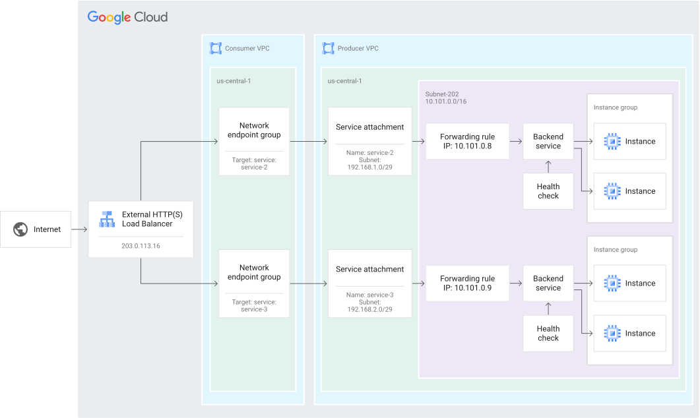
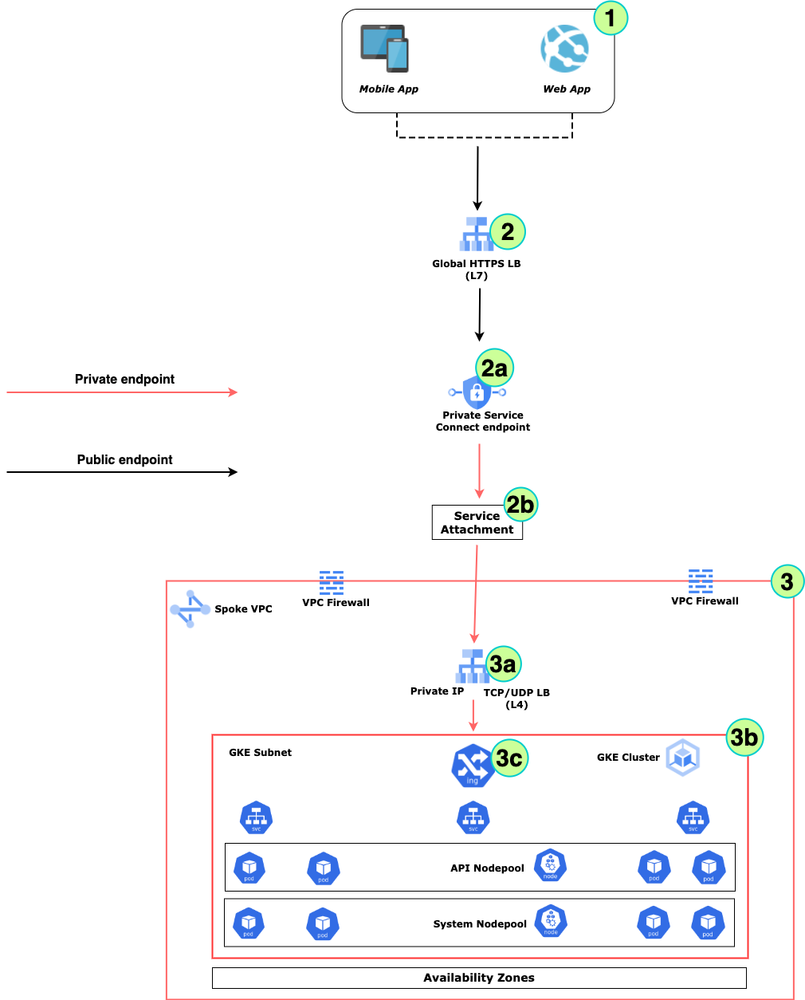
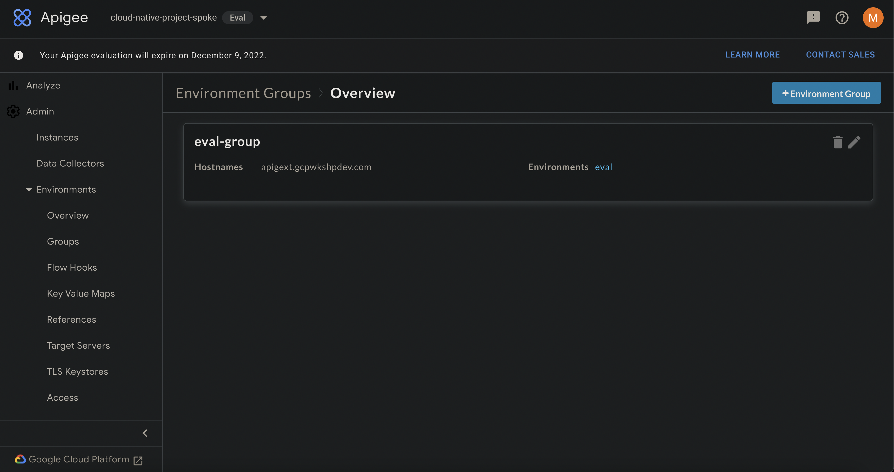
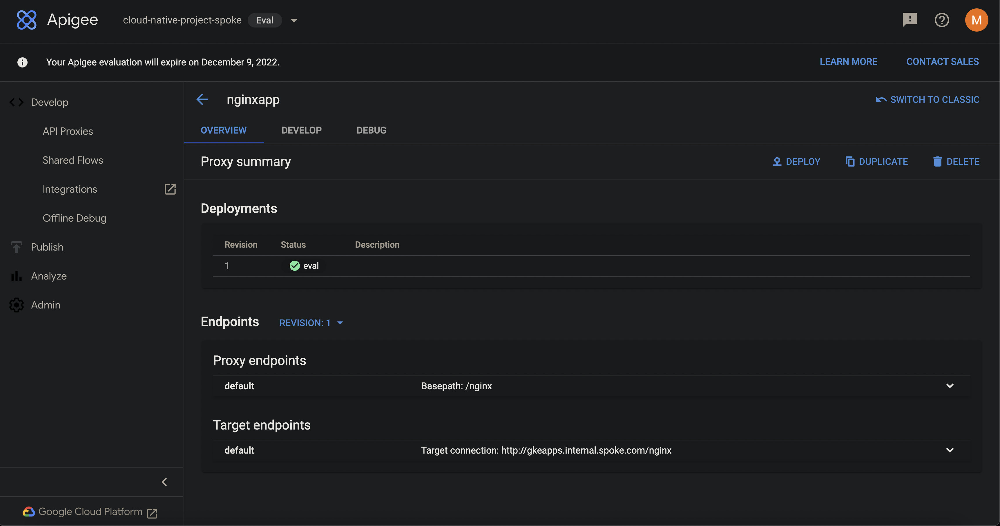
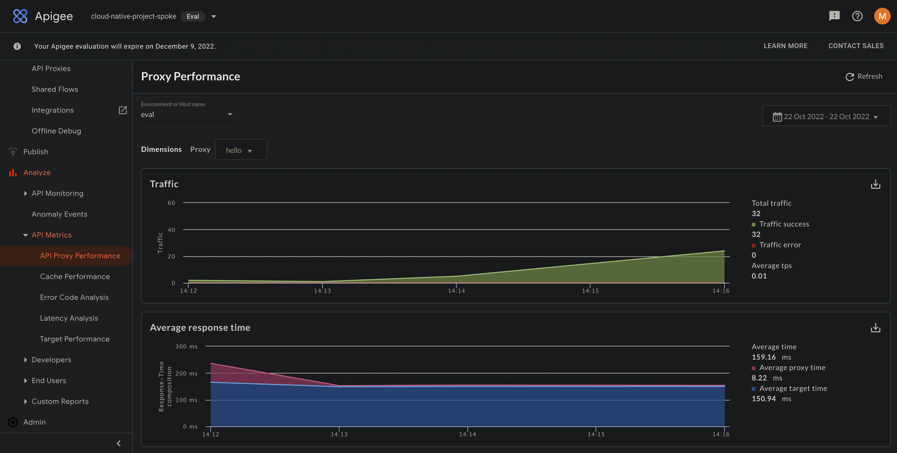
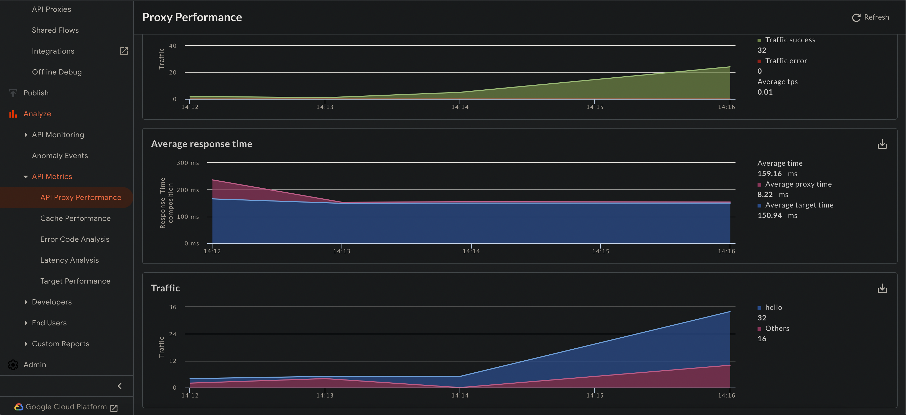
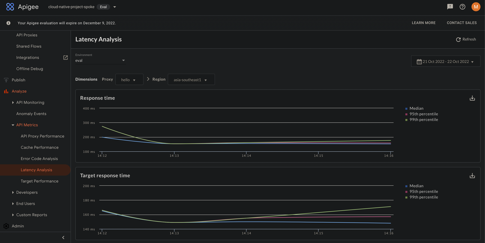
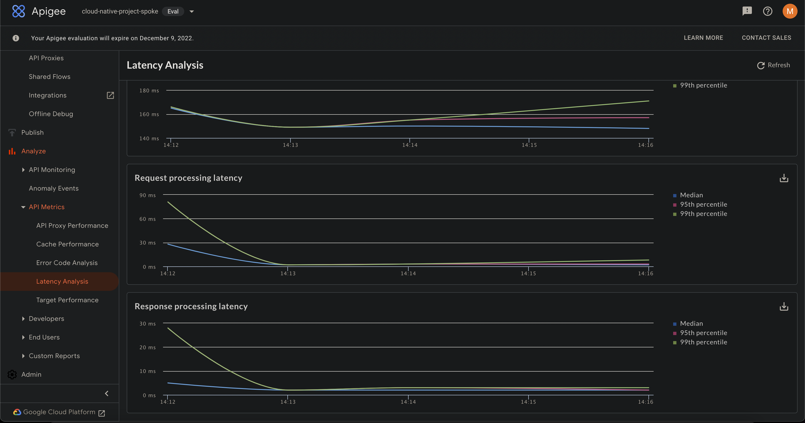
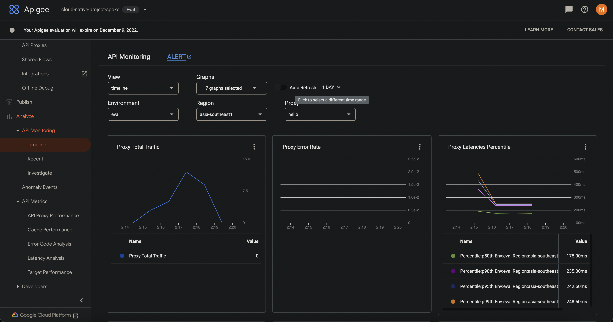
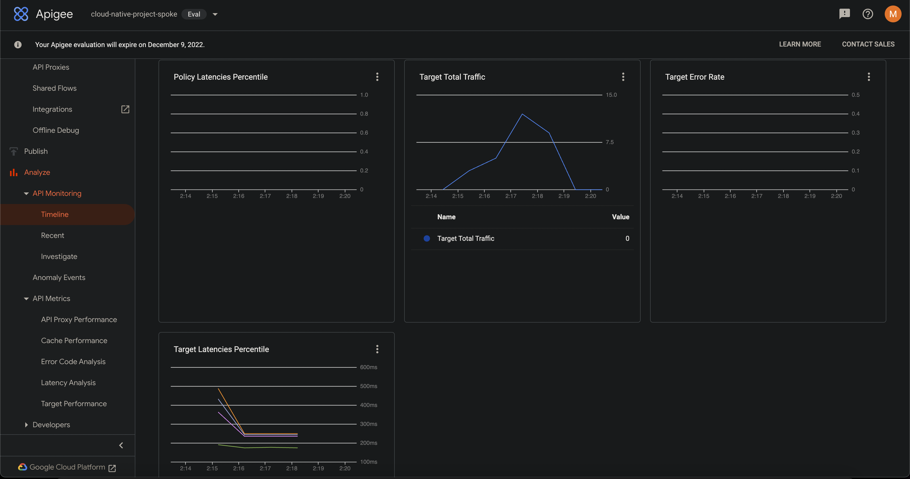

# Securely Ingress to GKE using Private Service Connect (PSC)

## Introduction

There are multiple ways to securely connect to backend micro services deployed in GKE cluster. The purpose of this document is to depict one such way on how to achieve this using [Private Service Connect](https://cloud.google.com/vpc/docs/private-service-connect-backends)

## What is Private Service Connect?




**Private Service Connect (PSC)** allows private communication between services across VPC networks residing in different proejcts or organizations. Customers can can Publish managed services and Consume Google APIs and Service using Google backbone network. 

There are multiple ways to use PSC viz.

- [Use Private Service Connect to access Google APIs](https://cloud.google.com/vpc/docs/private-service-connect#benefits-apis)
- [Use Private Service Connect to access Google APIs with consumer HTTP(S) service controls](https://cloud.google.com/vpc/docs/private-service-connect#benefits-controls)
- [Use Private Service Connect to publish and consume managed services](https://cloud.google.com/vpc/docs/private-service-connect#benefits-services)

This document focuses on the middle one i.e. how to use Private Service Connect to ingress to a backend which is dpeloyed onto a GKE cluster as micro-services. Please note that the Backend can be anywhere - same or different projects, organizations. This also provides a way to expose SaaS like applications to be hosted on GCP and expose it to multiple consumers Seamlessly, Securely and Flexibly.

The key components to achieve this end-to-end would be as following:

- [Internal HTTP(S) LB](https://cloud.google.com/load-balancing/docs/l7-internal)
- [Service Attachments](https://cloud.google.com/sdk/gcloud/reference/beta/compute/service-attachments/create)
- [Network Endpoint Groups](https://cloud.google.com/load-balancing/docs/negs)
- [External HTTP(S) LB](https://cloud.google.com/load-balancing/docs/https)

## Steps to build this

Following are the steps we would follow as we move on:

- Create required Infrastructure

- Create a  **private Regional GKE Cluster**; but all steps hold good for a Public cluster also

- Deploy couple of simple microservices onto the GKE cluster

- Deploy **Nginx Ingress Controller** as an Internal Load Balancer onto the GKE cluster. This creates a **internal Regional TCP/UDP Load Balancer (Layer 4)** in GCP with a **Private IP address**.

  > **NOTE**
  >
  > This can be GKE Native Ingress controller also. GKE Ingress currently does not support all Nginx specific Annotations and features; e.g. Reqrite rules etc. Hence this document relies on Nginx only.

- Create **Service Attachment** resource pointing to the forwarding rule of the *Internal LB*

- Create a *Private Servce Connect* **Network Endpoint Group**. This can act as the backend for an *External Load Balancer*

- Create a **Global HTTP(S) Load Balancer (Layer 7)** that would connect to the NEG which in-turn connects to the backend micro-services onto the GKE cluster through the **Service Attachment** created earlier

- Test the Application flow end-to-end using **Postman**

## Let us delve into this



### Prerequisites

- An active GCP Subscription
- A Github account (optional)
- [kubectl](https://kubernetes.io/docs/tasks/tools/)
- [gcloud sdk](https://cloud.google.com/sdk/docs/install-sdk)
- [Visual Studio Code](https://code.visualstudio.com/download) (*Optional*) or any other preferred IDE

### Prepare Environment

Let us prepare the environment first even before creating the GKE cluster

- Setup **Environment** variables

  ```bash
  PROJECT_NAME="cloud-native-spoke"
  REGION="<compute/region>"
  ZONE="<compute/zone>"
  SA_NAME="<sa-name>"
  GSA="$SA_NAME@${PROJECT_NAME}.iam.gserviceaccount.com"
  CLUSTER="gke-public-cluster"
  VPC_NAME="spoke-vpc"
  CLUSTER_SUBNET_NAME="gke-cluster-subnet"
  PROXY_SUBNET_NAME="gke-proxy-only-subnet"
  PSC_SUBNET_NAME="gke-psc-subnet"
  JUMP_SERVER_SUBNET_NAME="jumper-server-subnet"
  ```

- Create and Configure a **GCP project**

  ```bash
  gcloud projects create $PROJECT_NAME
  
  #Set this as the Current project
  gcloud config set project $PROJECT_NAME
  
  #Enable Region and Zone for the compute
  gcloud config set compute/region $REGION
  gcloud config set compute/zone $ZONE
  ```

- Create a **Service Account**

  ```bash
  #Service Account with Owner privilege that would be used across various resources in this example
  gcloud iam service-accounts create $GSA --display-name "SA for All Infra"
  gcloud iam service-accounts list
  
  gcloud iam service-accounts keys create "$SA_NAME.json" --iam-account=$GSA
  
  gcloud projects add-iam-policy-binding $PROJECT_NAME --role="roles/owner" \
  --member="serviceAccount:${GSA}"
  
  #Authenticate with the Servie Account - $GSA
  gcloud auth activate-service-account $GSA --key-file="$SA_NAME.json"
  ```

- Create **Network** infrastructure

  ```bash
  gcloud compute networks create $VPC_NAME --project=$PROJECT_NAME --subnet-mode=custom --mtu=1460 \
  --bgp-routing-mode=regional
  
  #Subnet for GKE cluster
  gcloud compute networks subnets create $CLUSTER_SUBNET_NAME --network=$VPC_NAME --range=10.0.0.0/22
  
  #Secondary IP ranges for GKE cluster subnet; these ranges are used by PODs and Services in the GKE cluster
  gcloud compute networks subnets update $CLUSTER_SUBNET_NAME \
  --add-secondary-ranges=pods-range=10.1.0.0/16,services-range=10.2.0.0/16
  
  #Proxy Subnet - needed for proxy of Internal HTTP(S) LB
  gcloud compute networks subnets create $PROXY_SUBNET_NAME --purpose=REGIONAL_MANAGED_PROXY --role=ACTIVE --network=$VPC_NAME --range=10.0.4.0/24
  
  #Subnet for Private Service Connect - needed for connecting to Apigee from Global HTTP(s) LB over Private Endpoint
  gcloud compute networks subnets create $PSC_SUBNET_NAME --purpose=PRIVATE_SERVICE_CONNECT --role=ACTIVE \
  --network=$VPC_NAME --range=10.0.5.0/24
  
  #Subnet for Jump Server VM (Optional) - needed for accessing/testing the Private Endpoints
  gcloud compute networks subnets create $JUMP_SERVER_SUBNET_NAME --network=$VPC_NAME --range=10.0.6.0/24
  ```

- Create **Firewall Rules** for the VPC network

  ```bash
  #Allow ssh from all sources
  gcloud compute firewall-rules create allow-ssh-rule --network $VPC_NAME --allow tcp:22 \
  --source-ranges=0.0.0.0/0
  
  #Allow ingress from GFE (Google Front End) IPs for Health check of the backend services of the Load Balancer
  gcloud compute firewall-rules create allow-health-check --network=$VPC_NAME \
  --action=allow --direction=ingress --source-ranges=130.211.0.0/22,35.191.0.0/16 --rules=tcp
  
  #Allow ingress from Proxy Subnet for Internal HTTP(S) LB
  gcloud compute firewall-rules create allow-proxies --network=$VPC_NAME \
  --action=allow --direction=ingress --source-ranges=10.0.4.0/24 --rules=tcp:80,tcp:443,tcp:8080
  
  #Allow ingress from Jump Server
  gcloud compute firewall-rules create allow-jumper-internal --network=$VPC_NAME \
  --action=allow --direction=ingress --source-ranges=10.0.6.0/24 --rules=tcp:80,tcp:443,tcp:8443,tcp:8080
  ```

- Setup a **Jump Server VM**

  ```bash
  gcloud compute addresses create gke-jump-server-ip --region=$REGION
  JUMPSERERIP=$(gcloud compute addresses describe gke-jump-server-ip --format="get(address)")
  
  #Create Jump Server VM
  gcloud compute instances create jumper-server --image-family=debian-10 --image-project=debian-cloud \
  --network=$VPC_NAME --subnet=$JUMP_SERVER_SUBNET_NAME --zone=$ZONE --project=$PROJECT_NAME
  
  #Internal IP of Jump Server VM
  gcloud compute instances describe jumper-server --format="get(networkInterfaces[0].networkIP)" \
  --project=$PROJECT_NAME
  
  #External IP of Jump Server VM
  gcloud compute instances describe jumper-server \
  --format="get(networkInterfaces[0].accessConfigs[0].natIP)" --project=$PROJECT_SPOKE
  ```
  
- Configure **Jump Server VM**

  ```bash
  #Connect to the Jump server VM from local machine or cloud shell
  gcloud compute ssh --zone $ZONE jumper-server --project=$PROJECT_NAME
  
  #Install snap dameon and core components; to be used to install other tools
  sudo apt-get install snapd
  sudo snap install core
  
  #Install kubectl
  sudo snap install kubectl --classic
  
  #Install helm
  sudo snap install helm --classic
  
  #Install gcloud sdk auth plugin
  sudo apt-get install google-cloud-sdk-gke-gcloud-auth-plugin
  
  gcloud auth list
  
  #Create a file to hold secrets of Service Account ($GSA)
  #Copy the contents of the file (from local machine or cloud shell) and paste into the file <sa-name>.json
  vi <sa-name>.json
  
  #Authenicate using the Service Account $GSA
  gcloud auth activate-service-account $GSA --key-file="./<sa-name>.json"
  
  gcloud config set compute/region $REGION
  gcloud config set compute/zone $ZONE
  gcloud config set project $PROJECT_NAME
  ```

### Deploy and Configure GKE Cluster

- Refer **3** and **3b**  in the above diagram

- Create a public **GKE cluster**

  ```bash
  gcloud container clusters create $CLUSTER --release-channel=regular --region=$REGION \
  --enable-ip-alias --enable-autoscaling \
  --num-nodes=1 --min-nodes=1 --max-nodes=3 --max-pods-per-node=40 \
  --network=$VPC_NAME --subnetwork=$CLUSTER_SUBNET_NAME \
  --cluster-secondary-range-name=pods-range --services-secondary-range-name=services-range \
  --service-account=$GSA --workload-pool=$PROJECT_NAME.svc.id.goog
  ```

- Connect to the **GKE cluster**

  ```bash
  gcloud container clusters get-credentials $CLUSTER --region=$REGION --project=$PROJECT_NAME
  ```

- Create Configuration file for **Nginx Ingress controller**

  - Name it as - **internal-nginx-ingress-config.yaml**

  ```yaml
  controller:
    service:  		
        annotations:
        	#Ensures Intrnal LB; this creates TCP/UDP (L4) LB on gCP
          cloud.google.com/load-balancer-type: "Internal"
        #Static IP for Internal LB; to be resolved through a Private DNS Zone later
        loadBalancerIP: 10.0.0.100
  ```

- Deploy **Nginx Ingress controller**

  - Refer **3a** in the above diagram
  
  ```bash
  helm repo add ingress-nginx https://kubernetes.github.io/ingress-nginx
  helm repo update
  
  #Install or Upgrade helm packag of Nginx ingress controller
  helm upgrade --install -f ./internal-nginx-ingress-config.yaml nginx-ingress ingress-nginx/ingress-nginx -n nginx-ingress-ns --create-namespace
  ```
  

### Deploy a Private DNS Zone

- The Private DNS Zone will beused to resolve Private IP addresses used by various resources in the projec.

- The Privaye IP of the Internal LB created above would be resolved using this Private DNS Zone

- If one such zone already exists then we can use it as-is; otherwise:

  - Create a **Private DNS Zone** on GCP

    ```bash
    gcloud dns managed-zones create $PROJECT_NAME-zone --dns-name internal.spoke.com. \
    --visibility=private --networks=$VPC_NAME --description="Private Zone"
    ```

- Add **A-record** for each microservcies (*to be deployed later*)

  ```bash
  gcloud dns record-sets create apacheapp.internal.spoke.com. --rrdatas=10.0.0.100 --type=A --ttl=60 \
  --zone=$PROJECT_NAME-zone
  
  gcloud dns record-sets create nginxapp.internal.spoke.com. --rrdatas=10.0.0.100 --type=A --ttl=60 \
  --zone=$PROJECT_NAME-zone
  ```

  > **NOTE**
  >
  > - The Private IP of the Internal LB is **10.0.0.100** in this case
  >
  > - All microservices are behind the Internal LB; hence DNS A-record for each service should be mapped to the same IP
  >
  >   i.e. **10.0.0.100**

### Deploy Microservices

- Create Ingress file; name it as - **nginx-ingress.yaml**

  - Refer **3c** in the above diagram

  ```yaml
  apiVersion: networking.k8s.io/v1
  kind: Ingress
  metadata:
    name: gke-nginx-ingress
    annotations:
      kubernetes.io/ingress.class: nginx    
      nginx.ingress.kubernetes.io/rewrite-target: /$1      
  spec:	
    rules:
    - host: "apacheapp.<dns-name>"
      http:
        paths:
        - path: /apache/?(.*)
          pathType: Prefix
          backend:
            service:
              name: apacheapp-svc
              port:
                number: 80      
    - host: "nginxapp.<dns-name>"
      http:
        paths:
        - path: /nginx/?(.*)
          pathType: Prefix
          backend:
            service:
              name: nginxapp-svc
              port:
                number: 80
  ```

  - Deploy **nginx-ingress.yaml**

    ```bash
    kubectl apply -f ./nginx-ingress.yaml
    ```

    

- Create a deployment file **apacheapp-deploy.yaml**

  ```yaml
  apiVersion: apps/v1
  kind: Deployment
  metadata:
    labels:
      app: apacheapp-deploy
      name: apacheapp-deploy
  spec:
    replicas: 1
    selector:
      matchLabels:
        app: apacheapp-pod
        version: "1.0"
    template:
      metadata:
        labels:
          app: apacheapp-pod
          version: "1.0"
      spec:
        containers:
        - name: apacheapp
        	image: "docker.io/library/httpd:latest"        
          resources:
            requests:
              cpu: "100m"
              memory: "100Mi"
            limits:
              cpu: "200m"
              memory: "200Mi"
          ports:
          - containerPort: 80
  ---
  apiVersion: v1
  kind: Service
  metadata:
    name: apacheapp-svc
  spec:
    ports:
    - port: 80
      protocol: TCP
      targetPort: 80
    selector:
      app: apacheapp-pod
      version: "1.0"
    type: ClusterIP
  
  ```

  - Deploy **apacheapp-deploy.yaml**

    ```bash
    kubectl apply -f ./apacheapp-deploy.yaml
    ```

- Create a deployment file **nginxapp-deploy.yaml**

  ```yaml
  apiVersion: apps/v1
  kind: Deployment
  metadata:
    name: nginxapp-deploy  
  spec:
    selector:
      matchLabels:
        app: nginxapp-pod
        version: "1.0"
    replicas: 1
    template:
      metadata:
        labels:
          app: nginxapp-pod
          version: "1.0"
      spec:
        containers:
        - name: nginxapp
        	image: "docker.io/library/nginx:latest"
          resources:
            requests:
              cpu: "100m"
              memory: "100Mi"
            limits:
              cpu: "200m"
              memory: "200Mi"
          ports:
          - containerPort: 80
  ---
  apiVersion: v1
  kind: Service
  metadata:
    name: nginxapp-svc
  spec:
    type: ClusterIP
    selector:
      app: nginxapp-pod
      version: "1.0"
    ports:
    - protocol: TCP
      port: 80
      targetPort: 80
  ```

  - Deploy **nginxapp-deploy.yaml**

    ```bash
    kubectl apply -f ./nginxapp-deploy.yaml
    ```

### Deploy Apigee X

- Refer **2b** in the above diagram

- Enable **Apigee service** for the project

  ```bash
  gcloud services enable apigee.googleapis.com servicenetworking.googleapis.com --project=$PROJECT_NAME
  ```

- Create **Subnets** for **Apigee**

  ```bash
  #Requied by Apigee - a non-overlapping CIDR range of /22
  gcloud compute networks subnets create gke-apigee-subnet --network=$VPC_NAME --range=10.0.7.0/22
  
  #Apigee also requires a non-overlapping, available /28 CIDR range - used by Apigee to access the instance for troubleshooting purposes and cannot be customized or changed
  gcloud compute networks subnets create gke-apigee-troublesdhoot-subnet --network=$VPC_NAME \
  --range=10.0.12.0/28
  ```

- Prepare environment for **Apigee** deployment

  ```bash
  APIGEE_RANGE_NAME=apigeex-svcs
  APIGEE_MANAGED_RANGE_NAME=apigeex-managed-svcs
  NETWORK_NAME=$VPC_NAME
  
  gcloud compute addresses create $APIGEE_RANGE_NAME \
    --global \
    --prefix-length=22 \
    --network=$NETWORK_NAME --purpose=VPC_PEERING --project=$PROJECT_NAME
  
  gcloud compute addresses create $APIGEE_MANAGED_RANGE_NAME \
    --global \
    --prefix-length=28 \
    --network=$NETWORK_NAME --purpose=VPC_PEERING --project=$PROJECT_NAME
  ```

- Create **VPC peering** between VPC of the current project and the VPC of the Apigee project

  ```bash
  gcloud services vpc-peerings connect \
    --service=servicenetworking.googleapis.com \
    --network=$NETWORK_NAME --ranges=$APIGEE_RANGE_NAME,$APIGEE_MANAGED_RANGE_NAME --project=$PROJECT_NAME
  ```

- Deploy **Apigee X**

  ```bash
  gcloud alpha apigee organizations provision \
    --runtime-location=$RUNTIME_LOCATION \
    --analytics-region=$ANALYTICS_REGION \
    --authorized-network=$NETWORK_NAME --project=$PROJECT_NAME
  ```

  - This creates an Apigee [Eval org](https://cloud.google.com/apigee/docs/api-platform/get-started/eval-orgs) 
  - It normally takes around 45 mins. to deploy Apigee

- Configure **Apigee X**

  - Once the Eval org is created, move to GCP console and access Apigee X menu

    

  - Create Proxies for each Microservice

    

    

    > **NOTE**
    >
    > - The **Target Endpoint** should point to the internal DNS name for each service; viz. *apacheapp.internal.spoke.com* or *nginxapp.internal.spoke.com*
    >
    > - The **Proxy Endpoint** should map to the Prefix in the **nginx-ingress.yaml** file or each miroservice; e.g. */nginx* or */apache**
    >
    >   [*The target and proxy endpoints shown in the figure is just for an example*]

  - Test the services through Apigee endpoint

    ```bash
    AUTH="Authorization: Bearer $(gcloud auth print-access-token)"
    
    ENV_GROUP_HOSTNAME=$(curl -H "$AUTH" https://apigee.googleapis.com/v1/organizations/$PROJECT_NAME	/envgroups -s | jq -r '.environmentGroups[0].hostnames[0]')
    
    INTERNAL_LOAD_BALANCER_IP=$(curl -H "$AUTH" https://apigee.googleapis.com/v1/organizations/$PROJECT_NAME/instances -s | jq -r '.instances[0].host')
    
    echo $AUTH
    echo $PROJECT_ID
    echo $ENV_GROUP_HOSTNAME
    echo $INTERNAL_LOAD_BALANCER_IP
    
    curl -i -k -H "Host: $ENV_GROUP_HOSTNAME" https://$INTERNAL_LOAD_BALANCER_IP/apache
    curl -i -k -H "Host: $ENV_GROUP_HOSTNAME" https://$INTERNAL_LOAD_BALANCER_IP/nginx
    ```

    > **NOTE**
    >
    > - This document does SSL OffLoading at the Apigee X. [Refer](https://cloud.google.com/apigee/docs/api-platform/system-administration/options-configuring-tls)

### Deploy External Load Balancer

- Refer **2** and **2a** in the main architecture diagram

- Retrieve **Service Attachment** of the Apigee endpoint

  ```bash
  #Refer 2b in the main architecture diagram
  #Option1: Following lists all the organizations and their details.Find the value of the field named - service-attachment
  gcloud alpha apigee organizations list
  
  #Option2: Call Apigee REST API to get JSON response with Org details.Find the value of the field named - service-attachment
  curl -H "$AUTH" \
    "https://apigee.googleapis.com/v1/organizations/$PROJECT_NAME/envgroups/eval-group/attachments"
  
  ```

- Create **Global SSL certificate** in GCP

  ```bash
  gcloud compute ssl-certificates create cloud-lb-cert --certificate=<cert-name>.pem \
  --private-key=<private-key>.pem
  ```

- Setup **Environment** variables

  ```bash
  NEG_NAME="apigee-lb-neg"
  TARGET_SERVICE="<service-attachment field value from above section>"
  RUNTIME_LOCATION="$REGION"
  ANALYTICS_REGION="$REGION"
  NETWORK_NAME="$VPC_NAME"
  SUBNET_NAME="$PSC_SUBNET_NAME"
  PROJECT_ID="$PROJECT_NAME"
  ADDRESS_NAME="apigee-lb-address"
  BACKEND_SERVICE_NAME="apigee-bkend-service"
  URL_MAP_NAME="apigee-bkend-url-map"
  PROXY_NAME="apigee-bkend-proxy"
  FWD_RULE="apigee-fwd-rule"
  CERTIFICATE="cloud-lb-cert"
  ```

- Create **Network Endpoint Group** (NEG)

  ```bash
  #Refer 2a in the main architecture diagram
  gcloud compute network-endpoint-groups create $NEG_NAME \
    --network-endpoint-type=private-service-connect \
    --psc-target-service=$TARGET_SERVICE \
    --region=$RUNTIME_LOCATION \
    --network=$NETWORK_NAME \
    --subnet=$SUBNET_NAME \
    --project=$PROJECT_NAME
  ```

  > **NOTE**
  >
  > - **--network-endpoint-type** - Type of NEG is Private Service Connect
  > - **--psc-target-service** - This points to the Service Attachment exposed from the Apigee instance

- Create a **Global External HTTP(S) LB**

  ```bash
  gcloud compute addresses create $ADDRESS_NAME --ip-version=IPV4 --global --project=$PROJECT_NAME
  gcloud compute addresses describe $ADDRESS_NAME --format="get(address)" --global --project=$PROJECT_NAME
  
  gcloud compute backend-services create $BACKEND_SERVICE_NAME \
    --load-balancing-scheme=EXTERNAL_MANAGED \
    --protocol=HTTPS \
    --global --project=$PROJECT_NAME
  
  gcloud compute backend-services add-backend $BACKEND_SERVICE_NAME \
    --network-endpoint-group=$NEG_NAME \
    --network-endpoint-group-region=$RUNTIME_LOCATION \
    --global --project=$PROJECT_NAME
  
  gcloud compute url-maps create $URL_MAP_NAME \
    --default-service=$BACKEND_SERVICE_NAME \
    --global --project=$PROJECT_NAME
  
  gcloud compute ssl-certificates describe $CERTIFICATE \
     --global \
     --format="get(name,managed.status, managed.Status)"
  
  gcloud compute target-https-proxies create $PROXY_NAME \
    --url-map=$URL_MAP_NAME \
    --ssl-certificates=$CERTIFICATE --project=$PROJECT_NAME
  
  gcloud compute forwarding-rules create $FWD_RULE \
    --load-balancing-scheme=EXTERNAL_MANAGED \
    --network-tier=PREMIUM \
    --address=$ADDRESS_NAME \
    --target-https-proxy=$PROXY_NAME \
    --ports=443 \
    --global --project=$PROJECT_NAME
  ```
  
- Test service endpoints end to end

  ```bash
  curl -i -k https://apacheapp.<dns-name>.com/apache
  curl -i -k https://apacheapp.<dns-name>.com/nginx
  
  #The endpoints can be tested from POSTMAN or Web browser also
   https://apacheapp.<dns-name>.com/apache
   https://apacheapp.<dns-name>.com/nginx
  ```
  
- Additional observations through Apigee UI

  - **Performance**

  

  

  

  - **Latency**

  
  
  
  
  - **Timeline**
  
    
  
    
  
  
  

### Conclusion

This document tried to depict how micro-service backends residing within a GKE cluster can be exposed to the consumers in a Secure way through an API Gateway viz. Apigee

## References

- [Source Code](https://github.com/monojit18/GCPWorkshop.git) at Github
- [GKE Regional cluster](https://cloud.google.com/kubernetes-engine/docs/how-to/creating-a-regional-cluster#gcloud-init)
- [Apigee X](https://cloud.google.com/apigee/docs/api-platform/get-started/install-cli-eval)
