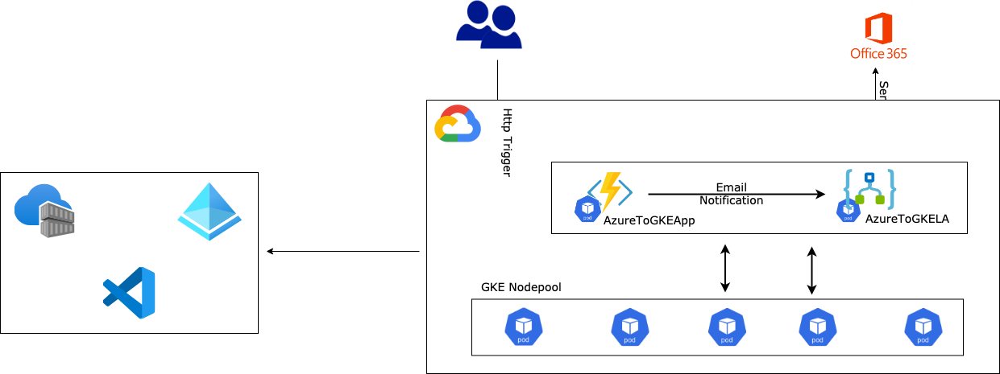
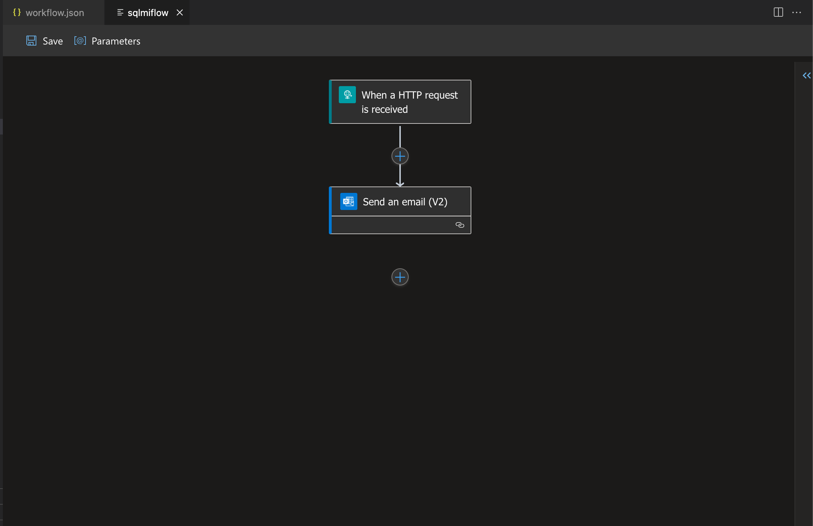
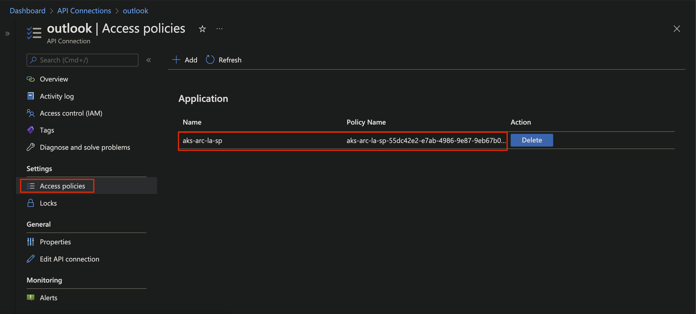
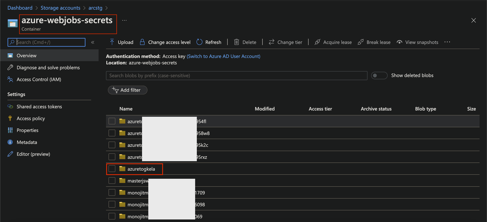
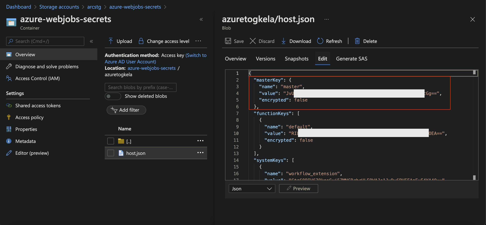
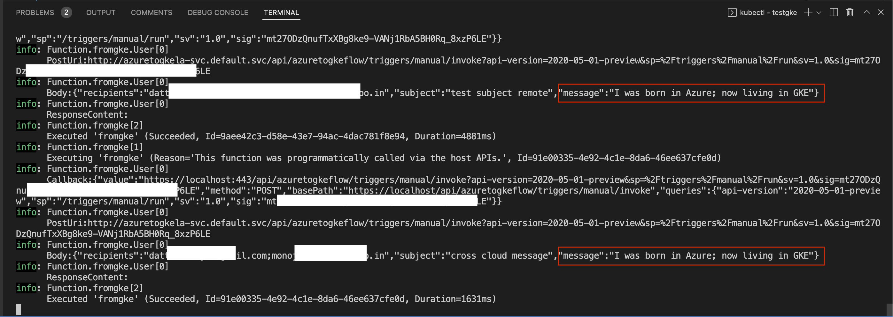

# Born in Azure, living in GKE

## Introduction

The purpose of this document is to show case how cloud native apps built, tested on one cloud platform can seamlessly run on other Cloud with minimal or no changes.

## What are we going to build?



In this article we will build an end-to-end flow of a connected set of simple micro-services consisting of Azure Function App and Logic App, run & test it locally and then deploy onto a GKE cluster seamlessly.

Following are the components to be deployed:

- **An Azure Function App** - This implemented the core business logic of Add, Update or Fetch from SQL MI database
- **A Logic App** - This implements the notification flow by sending emails to intended recipients and is triggered by the Function App

Both will be running Privately within the GKE cluster and is exposed only through an Ingress Controller. This article would deploy this Ingress Controller as a *Public Load Balancer* for simplicity; but a more stringent and recommended approach would be make this Ingress Controller as an *Internal Load Balancer* with private IP and expose it only through an Application Gateway or API Management resource, thus making the InBound access more secure.

## Steps to build this

Following are the steps we would follow as we move on:

- Create a basic Regional GKE Cluster. For simplicity, we would not add any additional security or features in this cluster
- Deploy an **Azure Function App** as Container onto the GKE cluster
- Deploy **Logic App** as container onto the GKE cluster
- Deploy an **Ingress Controller** to provide access to the application and data services running inside the cluster - we would be using **Nginx** here and configure it as a Public Load Balancer
- Deploy **Ingress routing** within the cluster
- Test the Application flow end-to-end using **Postman**

## Let us delve into this

### Prerequisites

- An active GCP Subscription
- A Github account (optional)
- [kubectl](https://kubernetes.io/docs/tasks/tools/)
- [gcloud sdk](https://cloud.google.com/sdk/docs/install-sdk)
- [Visual Studio Code](https://code.visualstudio.com/download) (*Optional*) or any other preferred IDE

### Prepare Environment

Let us prepare the environment first even before creating the GKE cluster

- Create **Azure Container Registry** on Azure
- Create **Virtual Networks** on GCP
- Create a **Regional GKE** cluster on GCP

#### Setting up GCP

If you are using GCP for the first time you need to run through the following steps.

- Open the GCP sdk folder in Visual Studio Code
- Open VSCode terminal
- Run through the following commands in the terminal to setup the GCP environment

```bash
# cd to GCP sdk folder
cd ./google-cloud-sdk

# Update GCp components
gcloud components update

# Install SDK
./install.sh
```

#### Initialise the Environment

We need to initialise the environment, create a project in GCP and few other configuration options. Multiple options of doing this; easiest of them is to run the following command and then run through the on-screen instructions.

```bash
gcloud init
```

> [!NOTE]
> This command would also allow you to Create or Assign a GCP project and all subsequent resources will be deployed under this project only.
>
> Since we will be using GCP compute resources foe this workload, we need to create a Billing account map our project(s) to it. Please follow this link for details - [Google Cloud Billing](https://cloud.google.com/billing/docs/concepts)

#### Container Registry

We can use [Google Artifact Registry](https://cloud.google.com/artifact-registry) or [Azure Container Registry](https://docs.microsoft.com/en-us/azure/container-registry/) for this exercise. Although we will be using ACR and pull images from within the GKE cluster with appropriate credentials, let su see what we need to do to use the GAR.

```bash
# Create a service account
gcloud iam service-accounts create <service-account-name> --description="gke workshop sa" --display-name="gke-workshop-sa"

# Assign roles to allow access to the Artifact Registry
gcloud projects add-iam-policy-binding <project-name> \
    --member="serviceAccount:<service-account-name>@<project-name>.iam.gserviceaccount.com" \
    --role="roles/artifactregistry.writer"
```

> [!TIP]
>
> Since we are using *Azure Container Registry* for this exercise, we need to note down the Registry Credentials which will needed later.

#### Create Virtual Networks

Let us create the virtual networks where GKE cluster will be hosted.

```bash
# Create the custom Regional VNET
gcloud compute networks create gke-workshop-vnet --subnet-mode=custom --bgp-routing-mode=regional

# Check list of Networks
gcloud compute networks list

# Add Firewall rules for the VNET
gcloud compute firewall-rules create gke-workshop-fw --network gke-workshop-vnet --allow tcp,udp,icmp

# Create Subnet tohost GKE cluster
gcloud compute networks subnets create gke-cluster-subnet --network=gke-workshop-vnet \
--range=11.0.0.0/24 --region=asia-east1

# Create Subnet to host the GKE cluster
gcloud compute networks subnets list --network=gke-workshop-vnet

# Assign sub ranges for Pods and Services within GKE cluster
gcloud compute networks subnets update gke-cluster-subnet  --region=asia-east1 \
--add-secondary-ranges pod-range=11.0.1.0/24,service-range=11.0.2.0/24
```

### Create GKE cluster

The following command would create a Regional GKE cluster with 2 Nodes and with maximum 60 Pods per Node.

```bash
gcloud container clusters create gke-workshop-cluster \
    --region=asia-east1 --enable-ip-alias \
    --network gke-workshop-vnet --subnetwork=gke-cluster-subnet \
    --cluster-secondary-range-name=pod-range --services-secondary-range-name=service-range \
    --node-locations=asia-east1-a --num-nodes=2 --default-max-pods-per-node 60
```

#### Connect to the GKE clsuter

```bash
gcloud container clusters get-credentials gke-workshop-cluster --region=asia-east1
```

#### Check the Cluster status

```bash
kubectl get nodes
```


### Applications

- Clone the [Repository](https://github.com/monojit18/GCP-Workshop.git)

- Create a **Storage Account** from the Azure Portal for Function app and Logic App to cache metadata and state

  > [!TIP]
  >
  > Note down the Storage Account credentials, **ConnectionString**, which will needed later.

#### AzureToGKELA

- A Logic App which is http triggered and accepts some simple text message and the intended recipients who should be notified by email

> [!NOTE]
>
> This Logic App is going to have a **Outlook.com** connection for sending emails. Any such API connections need a *Service Principal* to be created and given appropriate permission so that Logic App, running as a container (anywhere).

##### Build Logic App

- Please follow this [Blog](https://techcommunity.microsoft.com/t5/integrations-on-azure-blog/run-logic-app-anywhere/ba-p/3118351) link for details on how to deploy Logic app as container

- Create a **Service Principal on Azure** by any standard means - Portal or CLI; note down the **appId** and **password** values. Let us call it **gke-la-sp** for our easy reference later

- Open the project in *Visual Studio Code*

- Go to **AzureToGKELA**

- Open **local.settings.template.json**

  - Rename the file to **local.settings.json**
  - **AzureWebJobsStorage** - Replace it by the Storage Account connection string
  - **WORKFLOWS_TENANT_ID** - **TenantId** of the sub scripting being used
  - **WORKFLOWS_SUBSCRIPTION_ID** - **SubscriptionId** being used
  - **WORKFLOWS_RESOURCE_GROUP_NAME** - **Resource Group** for the Logic App
  - **WORKFLOWS_LOCATION_NAME** - **Location** of the Logic App
  - **WORKFLOWS_MANAGEMENT_BASE_URI** - https://management.azure.com/
  - **WORKFLOWAPP_AAD_TENANTID** - **TenantId** of the sub scripting being used
  - **WORKFLOWAPP_AAD_CLIENTID** - **appId** of the Service Principal
  - **WORKFLOWAPP_AAD_CLIENTSECRET** - **password** of the Service Principal
  - **WORKFLOWAPP_AAD_OBJECTID** - **ObjectId** of the user in Azure AD
  - **outlook-connectionKey** - *This will be assigned by the Logic App designer when we establish the **Outlook.com** connection*

- Open the AzureToGKELA/azuretogkeflow/workflow.json file in Logic App Designer from within VS Code

  

- The *Connection* object will be shown as an error as we need to reconfigure the connection here. Follow the On-screen instructions and complete the connection

- Once done, there will be **connection.json** file created within the workspace with the details of Outlook.com connection

- An API Connection will be created in the Azure portal; add the above service principal - **gke-la-sp** in the *Access Policies* section

  

- Review **connections.json**

  ```json
  {
    "managedApiConnections": {
      "outlook": {
        "api": {
          "id": "/subscriptions/<subscriptionId>/providers/Microsoft.Web/locations/eastus/managedApis/outlook"
        },
        "connection": {
          "id": "/subscriptions/<subscriptionId>/resourceGroups/arc-services-rg/providers/Microsoft.Web/connections/outlook"
        },
        "connectionRuntimeUrl": "https://<xxx>.common.logic-eastus.azure-apihub.net/apim/outlook/<yyy>/",
        "authentication": {
          "type": "Raw",
          "scheme": "Key",
          "parameter": "@appsetting('outlook-connectionKey')"
        }
      }
    }
  }
  ```

- Review **local.settings.json** file and look for **outlook-connectionKey** value

  ```json
  "outlook-connectionKey": "eyJ0eXAiOiJKV1QiLCJhbGciOi..........DPm0j1LWJ1FmgptA"
  ```

- We are now all set build and deploy this Logic App Locally

  ```bash
  # Build docker image
  docker build -t $acrName/<image_name>:<tag> .
  
  # Create logic app as Container and Run locally
  docker run --name azuretogkeflow -e AzureWebJobsStorage=$azureWebJobsStorage -e WORKFLOWAPP_AAD_TENANTID=<value> -e WORKFLOWAPP_AAD_CLIENTID=<value> -e WORKFLOWAPP_AAD_OBJECTID=<value> -r WORKFLOWAPP_AAD_CLIENTSECRET=<value> -d -p 8080:80 $acrName/<image_name>:<tag>
  ```

- Once the docker container is created locally, go to the Storage account in Azure  portal

  

  

  > [!TIP]
  >
  > Note down this **master key**. This will be used by local Logic App docker container to call Logic App Apis internally. Please note, since we are not using the Azure portal and its designer, it is our responsibility to call Logic App Apis internally, to get the metadata information e.g. the Post Url of the Http triggered Logic App.

- At this point we are all set to test the Logic App locally from any rest client like *Postman*

  ```bash
  # Get the POST url for the Logic App
  curl -X POST http://localhost:8080/runtime/webhooks/workflow/api/management/workflows/azuretogkeflow/triggers/manual/listCallbackUrl?api-version=2020-05-01-preview&code=<master key>
  
  # Response
  {
      "value": "https://localhost:443/api/azuretogkeflow/triggers/manual/invoke?api-version=2020-05-01-preview&sp=%2Ftriggers%2Fmanual%2Frun&sv=1.0&sig=<signature>",
      "method": "POST",
      "basePath": "https://localhost/api/sqlmiflow/triggers/manual/invoke",
      "queries": {
          "api-version": "2020-05-01-preview",
          "sp": "/triggers/manual/run",
          "sv": "1.0",
          "sig": "<signature>"
      }
  }
  
  # Use the Signature value to form the POST url for the Logic App and call it
  curl -X POST http://localhost:8080/api/azuretogkeflow/triggers/manual/invoke?api-version=2020-05-01-preview&sp=%2Ftriggers%2Fmanual%2Frun&sv=1.0&sig=<signature> --data '{"recipients": "<email-id-1>;<email-id-2>", "subject": "test subject", "message": "test message"}'
  ```

- If everything is ok then we should get an Email. Let us now build and push this Logic app image to **Azure Container Registry**

  ```bash
  az acr build -t <acrName>.azurecr.io/azuretogkela:v1.0.0 -r <acrName> .
  ```

#### CrossCloudApp

- An Azure Function App which is http triggered and accepts any text message and some simple metadata with information like intended recipients
- Function app then simply parses this metadata, find the intended recipients, extract the message and posts this to a Logic App running inside the cluster; which then sends the email to the intended recipients

##### Build Function App

- Go to **CrossCloudApp** folder

- Open **local.settings.template.json**

  - Rename the file to **local.settings.json**
  - **LOGICAPP_CALLBACK_URL** - Replace **Code** by the master key from Azure Storage as explained in the Logic App deployment section
  - **LOGICAPP_POST_URL** - Nothing to be changed here; this will be set appropriately by the function app itself

- Build the Function App and Push to Azure Container Registry

  ```bash
  az acr build -t <acrName>.azurecr.io/azuretogkeapp:v1.0.0 -r <acrName> .
  ```

#### Deploy Applications onto GKE cluster

We will now configure the GKE cluster and deploy few additional resources to make the deployment work seamlessly for both Function App and Logic App and thus for the entire end-to-end flow.

```bash
# Create Secret for accessing and downloading images from ACR
kubectl create secret docker-registry gkewkshpacr-secret --docker-server=<ACR server> --docker-username=<ACR username> --docker-password=<ACR password>

# Create Secret for the Function app to call Logic App metadata API
kubectl create secret generic logicapp-callback-secret --from-literal=LOGICAPP_CALLBACK_URL="<value from local.settings.json>" --from-literal=LOGICAPP_POST_URL="<value from local.settings.json>" --from-literal=AzureWebJobsStorage="<Storage account credentials>"

# Create Secret for Logic App, its internal operations and associated Outlook connection permission
kubectl create secret generic logicapp-secret --from-literal=AzureWebJobsStorage="<Storage account credentials>" --from-literal=WORKFLOWAPP_AAD_CLIENTID="<value from local.settings.json>" --from-literal=WORKFLOWAPP_AAD_TENANTID="<value from local.settings.json>" --from-literal=WORKFLOWAPP_AAD_CLIENTSECRET="<value from local.settings.json>" --from-literal=WORKFLOWAPP_AAD_OBJECTID="<value from local.settings.json>" --from-literal=outlook-connectionKey="<value from local.settings.json>"

# Go to testgke folder
cd testgke

# Deploy Logic App - AzureToGKELA
kubectl apply -f ./microservices/azuretogkela-v1.yaml

# Deploy Azure Function App - CrossCloudApp
kubectl apply -f ./microservices/azuretogkeapp-v1.yaml
```

#### Deploy Nginx Ingress Controller

```bash
# Install Nginx Ingress Controller
helm repo add ingress-nginx https://kubernetes.github.io/ingress-nginx
helm repo update

kubectl create ns arc-nginx-ingess-ns
helm install nginx-ingess ingress-nginx/ingress-nginx --namespace nginx-ingess-ns \
--set controller.replicaCount=2 --create-namespace

# Post Installation - check the Public IP
kubectl get svc -n nginx-ingess-ns -w
```

> [!TIP]
>
> - Note down the **Public IP** as we will need this later
> - This can be added as an **A-record** in DNS server to make it better accessible

#### Deploy K8s Ingress

```bash
# Go to testgke folder
cd testgke

# Deploy Ingress object
kubectl apply -f ./ingress/hello-ingress.yaml
```

### Test the Application flow

Let us now test the application flow end-to-end.

#### Send Notification

```bash
curl -X POST http://<Pubkic IP of Ingress Controller>.nip.io/apps/api/message --data '{"recipients": "<email-id-1>;<email-id-2>", "subject": "cross cloud message"}'

#Response
I was born in Azure living in GKE
```



### Conclusion

This end to end application flow depicts how multiple event driven applications - two n this case, an Azure function app and a Logic App - can talk to each other seamlessly, **run anywhere** (**GCP**) as Containers. This represents a cost effective, flexible, resilient way of running Cloud Native Apps on variety platforms - **On-Premise**, **Edge** or **Cloud**.

## References

- [Source Code](https://github.com/monojit18/GCP-Workshop.git) at Github

- [GKE Regional cluster](https://cloud.google.com/kubernetes-engine/docs/how-to/creating-a-regional-cluster#gcloud-init)

- [Run Logic App Anywhere](https://techcommunity.microsoft.com/t5/integrations-on-azure-blog/run-logic-app-anywhere/ba-p/3118351)

  
